<div align="center">

# 🇲🇾 Malaysian Amateur Radio Callbook

### The Modern Interactive Directory for Malaysian Ham Radio Operators

[](https://callbook.hamradio.my)
[](https://callbook.hamradio.my)

[](https://react.dev/)
[](https://vitejs.dev/)
[](https://supabase.com/)
[](LICENSE)

*A sleek, glassmorphism-styled directory for the Malaysian amateur radio community*

</div>

---

## ✨ Features

### 🔍 Intelligent Search & Discovery
*   **Advanced Filtering**: precise search by Callsign, Name, State (Location), and License Class (A/B/C).
*   **Instant Results**: Optimized query performance for rapid lookups.
*   **License Indicators**: Visual cues for Active 🟢, Expiring 🟠, and Expired 🔴 statuses.

### 🔐 Secure Identity & Access
*   **Supabase Auth**: Robust email/password authentication flow.
*   **User Management**: Complete 'Forgot Password' and 'Change Password' workflows.
*   **Role-Based Access**: Protected routes ensuring only owners can edit their data.

### 📡 Operator Portfolio
*   **My Callsigns**: A private dashboard to manage your submitted stations.
*   **vCard Export**: One-click download to save operator details directly to phone contacts.
*   **Social Connectivity**: Link your QRZ.com, Facebook, Website, and **Telegram** profiles.
*   **Telegram Integration**: Add your Telegram username (displayed with clickable link) and Chat ID for license expiry reminders.

### 📊 Live Analytics
*   **Real-Time Dashboard**: Live counter of total operators and daily registrations.
*   **Data Visualization**: Breakdown of operators by License Class (9M vs 9W) and Top 5 Locations.

### 📱 Modern User Experience
*   **Glassmorphism Design**: A premium, translucent aesthetic inspired by macOS/Windows 11.
*   **Fully Responsive**: Flawless experience on mobile phones, tablets, and desktops.
*   **Interactive Modals**: Smooth transitions for data entry and user updates.

### ⚡ Performance Optimizations
*   **Lazy Loading**: Routes (Login, Register, MyCallsigns, etc.) are loaded on-demand using `React.lazy()`, reducing initial bundle size by ~30KB.
*   **Code Splitting**: Vite automatically creates separate chunks for lazy-loaded components, improving first contentful paint.
*   **React.memo**: Card components are memoized to prevent unnecessary re-renders when scrolling through the directory.
*   **Suspense Boundaries**: Loading spinners are shown while lazy components are being fetched for smooth UX.
*   **Infinite Scroll**: Uses Intersection Observer API to automatically load more data as users scroll, eliminating the need for "Load More" buttons.
*   **Optimized Queries**: Supabase queries use pagination (50 items/page) to reduce payload size and improve response times.
---

## 🛡️ Project Legacy & Technical Decisions

> *"We built this to last forever, for free."*

This project was architected by **9M2PJU** with a specific mission: to provide a modern, interactive callbook for the Malaysian Amateur Radio community that can run **indefinitely without incurring monthly costs**. 

Every technical decision was made to ensure sustainability, preventing the project from disappearing due to lack of funding or server maintenance.

### 🏛️ The "Zero-Cost" Architecture
We utilize the generous free tiers of modern cloud infrastructure to guarantee longevity:
*   **Database (Supabase)**: We store text-based callsign data. With ~11k records currently, we utilize **< 6%** of the free 500MB limit. This capacity allows the directory to grow to **100,000+ operators** (sufficient for the next 10-20 years) without needing a paid plan.
*   **Hosting (Vercel)**: The frontend is static and cached globally. It handles traffic effortlessly within the 100GB/month bandwidth limit.
*   **Authentication**: Supabase Auth handles up to 50,000 monthly active users, far exceeding the size of our local community.

```mermaid
graph TD
    User([👤 User]) -->|HTTPS| CDN[⚡ Vercel Edge Network]
    CDN -->|Cached Assets| UI[⚛️ React Frontend]
    UI -->|Auth / Data| SB[🔥 Supabase Project]
    
    subgraph "Free Tier Infrastructure"
        SB -->|Identities| Auth[🔐 Supabase Auth]
        SB -->|Relational Data| DB[(🐘 PostgreSQL)]
        SB -->|Serverless| Edge[⚡ Edge Functions]
    end
    
    Auth -->|"Verify/Reset (OK)"| Email["📧 Resend (Email API)"]
    Edge -.->|"🚫 Bulk Reminders (Quota Limit)"| Email
    
    style User fill:#f9f,stroke:#333
    style CDN fill:#435,stroke:#333,color:#fff
    style SB fill:#3ecf8e,stroke:#333,color:#fff
```



### ⚠️ The Disabled Email System (Important)
We built a fully functional **License Expiry Reminder System** (`supabase/functions/license-reminder`), designed to notify operators when their license is expiring (90, 60, 30, 14, 7, 3, 1 days before).

**However, we have intentionally DISABLED this feature (`const EMAIL_ENABLED = false`).**

**Why?**
The email service (Resend) provides **100 free emails/day**.
*   With 11,000 operators, we average ~42 reminder emails/day.
*   **The Risk**: If many licenses expire on the same day (a "cluster" event), the system would attempt to send >100 emails, hit the limit, and fail.
*   **The Decision**: To protect the project's free status, we disabled this potentially volatile feature. We prioritized **system stability** over this convenience feature.

### 🔮 Guide for Future Maintainers (The Road Ahead)
This project is built to be a resilient, long-term asset. All improvements below should be seen as stepping stones towards the **Dream Architecture** outlined in the next section.

1.  **📧 Re-enabling Emails (Step towards "Enterprise Email Service")**:
    *   **The Challenge**: Resend's free tier allows 100 emails/day. A "cluster" of expirations could breach this.
    *   **Solution A (Funded)**: If you have ~$20/mo, simply upgrade Resend and set `EMAIL_ENABLED = true`.
    *   **Solution B (Zero-Cost)**: Modify the Edge Function logic to stagger sends or use the **Self-Hosted SMTP** (`mailpit`) container in our Docker stack.

2.  **🖼️ Image Hosting (Step towards "Unrestricted Object Storage")**:
    *   **Warning**: Do not commit photos to this Git repo. It will break the app.
    *   **Solution A (Easiest)**: Use **Gravatar**. It's 100% free, automatic, and handles bandwidth for you.
    *   **Solution B (Supabase)**: Use Supabase Storage (1GB Free). *Caution*: Watch the 5GB egress limit.
    *   **Goal**: Eventually migrate to **AWS S3/MinIO** (see Dream Architecture #4) for unlimited high-res storage.

3.  **🛡️ Data Integrity & Automation (Step towards "Dedicated Search Engine")**:
    *   **The Goal**: Eliminate manual entry errors.
    *   **The Method**: Write a Python/Node.js script to periodically scrape the **MCMC Public Register**.
    *   **Future**: This clean data will be the foundation for the **Meilisearch** engine (Dream Architecture #3).

4.  **🪙 Community Governance**:
    *   Keep this project **Open Source (GPLv3)**.
    *   Never put the data behind a paywall.
    *   The goal is to serve the hobby, not to profit.


### 🚀 The "Dream" Architecture (Growth Plan)
**If resources/funding were unlimited**, this is how we envision the project evolving to support high-resolution photos, global traffic, and unlimited features:

1.  **Global Content Delivery (CDN)**:
    *   Deploy frontend via **Cloudflare Enterprise** or **AWS CloudFront** with edge caching.
    *   This ensures instant load times (<100ms) for operators in Europe, Americas, and Asia, not just Malaysia.

2.  **Database Replication & Clustering**:
    *   Implement **Read Replicas** in multiple regions (Singapore, Japan, US) to reduce database latency.
    *   Use **pgbouncer** for connection pooling to handle 100,000+ concurrent connections during major contests or events.

3.  **Dedicated Search Engine**:
    *   Integrate **Meilisearch** or **Elasticsearch** (replacing simple SQL `LIKE` queries).
    *   Enables typo-tolerance ("Fizul" finds "Faizul"), phonetic search, and instant millisecond search results for millions of records.

4.  **Unrestricted Object Storage (S3)**:
    *   Implement **AWS S3** or **MinIO** for storage.
    *   Allows hosting terabytes of high-resolution QSL cards, station event photos, and field day galleries.

5.  **Multi-Platform Native Apps**:
    *   Build **React Native** or **Flutter** apps iOS and Android.
    *   Enable **Offline Mode**: Download the entire database to the phone for use in deep jungle operations (zero coverage areas).

6.  **IoT & Digital Radio Integration**:
    *   Build an API Bridge for **DMR / C4FM / D-STAR** networks.
    *   Allow radios to query the callbook via digital packets directly from the transceiver.

> *"With my limited resources, I tried my best to build a foundation that is robust, free, and useful. I pass this torch to the community to take it even further."* — 9M2PJU

---

## 🚀 Quick Start

### 🌐 View the Live Directory
**[callbook.hamradio.my](https://callbook.hamradio.my)**

> **Note**: You must **Register** or **Login** to view the directory. This protects the privacy of our operators.

### 📝 Register Your Callsign
1. **Sign Up** for an account on the website.
2. Click **"+ Add Callsign"** button in the navbar.
3. Fill out the form with your details.

---

## 🎨 Tech Stack

### Frontend (User Interface)
| Technology | Description |
|------------|-------------|
| ⚛️ **React 19** | Latest React features for a responsive, interactive UI. |
| ⚡ **Vite 7** | Next-generation build tool for lightning-fast development. |
| 🎨 **Glassmorphism** | Custom CSS3 styling for a modern, translucent aesthetic. |
| �️ **React Router** | Client-side routing for seamless navigation. |

### Backend (Serverless & Managed)
| Technology | Description |
|------------|-------------|
| 🐘 **PostgreSQL** | Relational database hosted on Supabase. |
| 🔐 **Supabase Auth** | Secure email/password authentication (GoTrue). |
| ⚡ **Edge Functions** | Deno-based serverless functions for scheduled tasks (Reminders). |
| 📡 **Realtime** | WebSocket subscriptions for live data updates. |

### DevOps & Infrastructure
| Technology | Description |
|------------|-------------|
| 🐳 **Docker** | Full stack containerization for self-hosting. |
| 🚢 **Vercel** | Static hosting with global CDN (Free Tier). |
| 🐙 **GitHub Actions** | Automated CI/CD pipelines. |
| 📬 **Resend** | Transactional email service (Free Tier). |


---

## 💻 Local Development (Legacy Mode)
For quick UI contributions (without spinning up the full Docker stack):

1.  **Install Dependencies**:
    ```bash
    npm install
    ```
2.  **Start Dev Server**:
    ```bash
    npm run dev
    ```
3.  **Open in Browser**:
    *   `http://localhost:5173`

> **Note**: This connects to the *Live* Supabase project by default (if keys are configured) or requires a local `.env` file pointing to your own project.

---

To ensure this project can survive even if Vercel or Supabase cease to exist, we have included a **Full Stack Docker Configuration**.

This `docker-compose.yml` spins up the **entire infrastructure** locally:
*   **Web App**: The React Frontend (Port 3000)
*   **PostgreSQL**: The Database (Port 54322)
*   **Supabase Stack**: Auth (GoTrue), API (PostgREST), Realtime, Storage
*   **Dashboard**: Supabase Studio UI (Port 8001)
*   **Mailpit**: Local SMTP Server for testing emails (Port 8025)

### How to Run (Local / VPS)
1.  **Clone the Repo**:
    ```bash
    git clone https://github.com/9M2PJU/9M2PJU-Malaysian-Amateur-Radio-Call-Book.git
    cd 9M2PJU-Malaysian-Amateur-Radio-Call-Book
    ```

2.  **Start the Stack**:
    ```bash
    docker compose up -d
    ```

3.  **Access the Services**:
    *   **Public Directory**: `http://localhost:3000`
    *   **Backend Dashboard**: `http://localhost:8001` (Manage Data/Users)
    *   **Email Inbox**: `http://localhost:8025` (View sent emails)

> **Note**: This setup uses default "development" keys. For production use on a public server, please change the JWT secrets and passwords in `docker-compose.yml`.

---
Contributions welcome! Report bugs, suggest features, or submit PRs.

---

## 💝 Support the Project

This project is maintained entirely for free by volunteers for the Malaysian amateur radio community. If you find it useful and would like to support its continued development and server costs, you can donate via:

*   **In-App Donation**: Click the ❤️ **Donate** button in the navigation bar to scan a QR code with your Malaysian banking or e-wallet app.

Your support helps keep the servers running and enables future improvements. Every contribution, big or small, is deeply appreciated!

---

## 💌 Message from the Author

> "This project is an initiative by me for all Malaysian Amateur Radio Operators. I hope someone will improve this project later for future generations. Amateur Radio is always the greatest hobby of all."
> 
> — **9M2PJU**

---

<div align="center">

**Made with ❤️ for the Malaysian Ham Radio Community**

[](https://hamradio.my)

*73 de 9M2PJU* 📻

</div>
