<div align="center">

  

  # 🇲🇾 Malaysian Amateur Radio Callbook
  
  **The Modern, Interactive, and Definitive Directory for Malaysian Ham Radio Operators**

  [](https://callbook.hamradio.my)
  [](https://callbook.hamradio.my)
  [](LICENSE)
  [](https://github.com/9M2PJU/9M2PJU-Malaysian-Amateur-Radio-Call-Book)

  [](https://react.dev/)
  [](https://vitejs.dev/)
  [](https://supabase.com/)
  [](https://www.postgresql.org/)
  [](https://web.dev/progressive-web-apps/)

  <p><em>A sleek, glassmorphism-styled, and community-driven directory meticulously crafted for the Malaysian amateur radio community. Built to be resilient, free, and forever accessible.</em></p>

</div>

---

## 📖 Introduction

Welcome to the **Malaysian Amateur Radio Callbook**, a next-generation directory designed to connect ham radio operators across Malaysia. This project goes beyond a simple list; it is a **comprehensive platform** built with the latest web technologies to provide a fast, secure, and beautiful user experience. Whether you are a veteran operator or a newly licensed ham, this platform is your gateway to the local community.

Our mission is simple yet ambitious: **"To build a digital legacy that lasts forever, for free."**

---

## ✨ Key Features

### 🔍 **Intelligent Search & Discovery**
Experience a search engine that thinks like you do.
*   **Precision Filtering**: Drill down deep using advanced filters for **Callsign**, **Name**, **State (Location)**, and even **License Class** (Class A, B, or C).
*   **Instantaneous Results**: Engineered for speed, our optimized query engine delivers search results in milliseconds, no matter how large the database grows.
*   **Visual Status Indicators**: At a glance, know who is active. We use intuitive visual cues—🟢 **Active**, 🟠 **Expiring Soon**, and 🔴 **Expired**—so you always have the most current information.

### 🔐 **Secure Identity & Access Management**
Your privacy and security are our top priorities.
*   **Robust Authentication**: Powered by **Supabase Auth**, we offer a secure, industry-standard email/password login flow.
*   **Self-Service Management**: Forgot your password? Need to update your credentials? Our complete **'Forgot Password'** and **'Change Password'** workflows put you in control.
*   **Role-Based Access Control (RBAC)**: We implement strict RLS (Row Level Security) policies, ensuring that **only you** can edit your personal data.
*   **Advanced Anti-Spam**: We integrate **Cloudflare Turnstile**, a smart, invisible CAPTCHA alternative, to keeping bots and spam at bay without annoying real users.
*   **Security Automation**: An intelligent **Auto-Logout** feature terminates idle sessions after 5 minutes, protecting your account even if you walk away from your screen.

### 📡 **Operator Portfolio & Social Connectivity**
More than just a callsign—it's your digital amateur radio identity.
*   **My Callsigns Dashboard**: A dedicated private command center to manage, update, and curate all your submitted station details.
*   **vCard Export**: Networking made easy. With a generic **One-Click Download**, fellow operators can save your contact details directly to their phone's address book.
*   **Social & Mesh Integration**: Seamlessly link your digital presence. Connect your **QRZ.com** page, **Facebook** profile, personal **Website**, and even your **Telegram** account.
*   **Telegram Integration**: Display your **Telegram Username** with a direct clickable link, and link your **Chat ID** to receive automated notifications and future license expiry reminders directly on your phone.

### 📊 **Live Analytics & Insights**
Keep your finger on the pulse of the community.
*   **Real-Time Dashboard**: Watch the community grow live. See a dynamic counter of total registered operators and track daily registrations as they happen.
*   **Data Visualization**: Gain insights with beautiful breakdowns of operators by **License Class** (9M vs 9W) and discover the **Top 5 Locations** with the highest density of hams.

### 📱 **Modern User Experience (UX/UI)**
Designed to delight, built to perform.
*   **Glassmorphism Aesthetic**: We've adopted a premium, translucent design language inspired by modern OS interfaces (macOS/Windows 11), creating a visual depth that looks stunning on any background.
*   **Progressive Web App (PWA)**: Install this website as a native-like app on your smartphone or desktop. works offline, loads instantly, and feels like a real app.
*   **Fully Responsive**: From the smallest smartphone to the largest ultra-wide monitor, our layout adapts fluidly to provide a flawless experience.
*   **Interactive Modals**: Data entry doesn't have to be boring. We use smooth, animated transitions for all our forms and dialogs.

### ⚡ **Extreme Performance Optimizations**
We are obsessed with speed.
*   **Lazy Loading Strategy**: We utilize `React.lazy()` to load major routes (Login, Register, Dashboard) only when you need them, slashing the initial bundle size by over **30%**.
*   **Smart Code Splitting**: Vite automatically chunks our code, ensuring the browser only downloads exactly what is needed for the current screen, drastically improving the **First Contentful Paint (FCP)**.
*   **Component Memoization**: Heavy components are optimized with `React.memo` to prevent wasted rendering cycles, ensuring buttery smooth scrolling even through thousands of records.
*   **Suspense Boundaries**: We handle loading states gracefully. Instead of blank screens, you see polished loading spinners while content is fetched in the background.
*   **Infinite Scroll**: Say goodbye to "Next Page" buttons. We use the **Intersection Observer API** to automagically load more operators as you scroll, creating an uninterrupted browsing flow.
*   **Optimized Database Queries**: Our Supabase queries are strictly paginated (50 items/batch), ensuring network payloads remain tiny and response times remain lightning fast.

---

## 📜 Release History

Stay up to date with the latest evolution of the platform.

### **v2.2.9** (Latest) - *2026-01-16*
*   **Refinement**: Reverted "New User Badge" logic to standard 30-day duration.
*   **Adjustment**: Reverted dashboard statistics to reflect a 30-day window.

### **v2.2.0** - *2026-01-16*
*   **Major Feature**: Launched **Smart Popups** for easier app installation and donations.
*   **UX Upgrade**: Implemented persistent "Install App" prompt for mobile users and unobtrusive desktop notifications.

### **v2.1.0** - *2026-01-16*
*   **Security**: Added **Cloudflare Turnstile** to all auth forms.
*   **Admin Tools**: Introduced `backup-db.sh` for secure local data backups.

### **v2.0.0** - *2026-01-16*
*   **Major Milestone**: Full **Progressive Web App (PWA)** support.
*   **Notifications**: Real-time live activity notifications for user presence and database changes.
*   **Design**: Complete overhaul with dark glassmorphism theme.

*(See [`CHANGELOG.md`](CHANGELOG.md) for the complete history.)*

---

## 🛡️ Project Legacy & Technical Decisions

> *"We built this to last forever, for free."*

This project was architected by **9M2PJU** with a singular, unwavering vision: to provide a state-of-the-art, interactive callbook for the Malaysian Amateur Radio community that can run **indefinitely without incurring monthly costs**. 

Every single technical decision, from the database choice to the hosting platform, was made with **sustainability** in mind. We engineered this system to effectively "live forever" on the internet, preventing it from suffering the fate of many community projects that disappear due to lack of funding or server maintenance.

### 🏛️ The "Zero-Cost" Architecture
We leverage the incredibly generous free tiers of modern cloud infrastructure to guarantee longevity:

1.  **Database (Supabase)**: We store efficient text-based callsign data. With approximately **11,000 records** currently, we utilize **less than 6%** of the free 500MB limit. This massive capacity headroom allows the directory to grow to **100,000+ operators**—sufficient for the next 10-20 years of growth—without ever needing a paid plan.
2.  **Hosting (Vercel)**: The frontend is a static site cached globally. It handles high traffic volumes effortlessly within the generous 100GB/month bandwidth limit.
3.  **Authentication**: Supabase Auth handles up to **50,000 monthly active users**, a number far exceeding the total size of our diverse local community.

```mermaid
graph TD
    User([👤 User]) -->|HTTPS| CDN[⚡ Vercel Edge Network]
    CDN -->|Cached Assets| UI[⚛️ React Frontend]
    UI -->|Auth / Data| SB[🔥 Supabase Project]
    
    subgraph "Free Tier Infrastructure"
        SB -->|Identities| Auth[🔐 Supabase Auth]
        SB -->|Relational Data| DB[(🐘 PostgreSQL)]
        SB -->|Serverless| Edge[⚡ Edge Functions]
    end
    
    Auth -->|"Verify/Reset (OK)"| Email["📧 Resend (Email API)"]
    Edge -.->|"🚫 Bulk Reminders (Quota Limit)"| Email
    
    style User fill:#f9f,stroke:#333
    style CDN fill:#435,stroke:#333,color:#fff
    style SB fill:#3ecf8e,stroke:#333,color:#fff
```



### ⚠️ The Disabled Email System (Important)
We built a fully functional **License Expiry Reminder System** (`supabase/functions/license-reminder`), intelligently designed to automatically notify operators when their license is expiring (at intervals of 90, 60, 30, 14, 7, 3, and 1 days before).

**However, we have intentionally DISABLED this feature (`const EMAIL_ENABLED = false`).**

**Why?**
The email service provider (Resend) provides **100 free emails per day**.
*   **The Math**: With 11,000 operators, we average ~42 reminder emails/day.
*   **The Risk**: If many licenses expire on the same day (a "cluster" event), the system would attempt to send >100 emails, instantly hitting the limit and causing failures.
*   **The Decision**: To protect the project's free status and reliability, we disabled this potentially volatile feature. We prioritized **system stability** and zero cost over this convenience feature.

---

## 🔮 Guide for Future Maintainers (The Road Ahead)

This project is built to be a resilient, long-term asset. All improvements below should be seen as stepping stones towards the **Dream Architecture** outlined in the next section.

1.  **📧 Re-enabling Emails (Step towards "Enterprise Email Service")**:
    *   **The Challenge**: Resend's free tier limit (100/day).
    *   **Solution A (Funded)**: Upgrade Resend (~$20/mo) and simple set `EMAIL_ENABLED = true`.
    *   **Solution B (Zero-Cost)**: Modify the Edge Function logic to stagger sends or use the **Self-Hosted SMTP** (`mailpit`) container in our Docker stack.

2.  **🖼️ Image Hosting (Step towards "Unrestricted Object Storage")**:
    *   **Warning**: Do not commit photos to this Git repo. It will bloat the history and break the app.
    *   **Solution A (Easiest)**: Use **Gravatar**. It's 100% free, automatic, and handles bandwidth.
    *   **Solution B (Supabase)**: Use Supabase Storage (1GB Free). *Caution*: Watch the 5GB egress limit.

3.  **🛡️ Data Integrity & Automation**:
    *   **The Goal**: Eliminate manual entry errors entirely.
    *   **The Method**: Write a Python/Node.js script to periodically scrape the **MCMC Public Register**.
    *   **Future**: This clean data will be the foundation for the **Meilisearch** engine.

4.  **🪙 Community Governance**:
    *   Keep this project **Open Source (GPLv3)**.
    *   Never put the data behind a paywall.
    *   The goal is to serve the hobby, not to profit.

---

## 🚀 The "Dream" Architecture (Growth Plan)

**If resources and funding were unlimited**, this is how we envision the project evolving to support high-resolution photos, massive global traffic, and unlimited features:

1.  **Global Content Delivery (CDN)**:
    *   Deploy frontend via **Cloudflare Enterprise** or **AWS CloudFront** with aggressive edge caching.
    *   This ensures instant load times (<100ms) for operators in Europe, Americas, and Asia.

2.  **Database Replication & Clustering**:
    *   Implement **Read Replicas** in multiple regions (Singapore, Japan, US) to reduce database latency.
    *   Use **pgbouncer** for connection pooling to handle 100,000+ concurrent connections during major contests.

3.  **Dedicated Search Engine**:
    *   Integrate **Meilisearch** or **Elasticsearch** (replacing simple SQL `LIKE` queries).
    *   Enables typo-tolerance ("Fizul" finds "Faizul"), phonetic search, and instant results for millions of records.

4.  **Unrestricted Object Storage (S3)**:
    *   Implement **AWS S3** or **MinIO** for storage.
    *   Allows hosting terabytes of high-resolution QSL cards, station event photos, and field day galleries.

5.  **Multi-Platform Native Apps**:
    *   Build **React Native** or **Flutter** apps iOS and Android.
    *   Enable **Offline Mode**: Download the entire database to the phone for use in deep jungle operations (zero coverage).

6.  **IoT & Digital Radio Integration**:
    *   Build an API Bridge for **DMR / C4FM / D-STAR** networks.
    *   Allow radios to query the callbook via digital packets directly from the transceiver.

> *"With my limited resources, I tried my best to build a foundation that is robust, free, and useful. I pass this torch to the community to take it even further."* — 9M2PJU

---

## 🚀 Quick Start

### 🌐 View the Live Directory
**[callbook.hamradio.my](https://callbook.hamradio.my)**

> **Note**: You must **Register** or **Login** to view the directory. This protects the privacy of our operators from public scraping.

### 📝 Register Your Callsign
1. **Sign Up** for an account on the website.
2. Click **"+ Add Callsign"** button in the navigation bar.
3. Fill out the form with your station details.

---

## 🎨 Tech Stack

### Frontend (User Interface)
| Technology | Description |
|------------|-------------|
| ⚛️ **React 19** | Latest React features for a responsive, interactive UI. |
| ⚡ **Vite 7** | Next-generation build tool for lightning-fast development. |
| 🎨 **Glassmorphism** | Custom CSS3 styling for a modern, translucent aesthetic. |
| 🛡️ **Turnstile** | Cloudflare's smart, invisible anti-spam protection. |
| 🗺️ **React Router** | Client-side routing for seamless navigation. |

### Backend (Serverless & Managed)
| Technology | Description |
|------------|-------------|
| 🐘 **PostgreSQL** | Relational database hosted on Supabase. |
| 🔐 **Supabase Auth** | Secure email/password authentication (GoTrue). |
| ⚡ **Edge Functions** | Deno-based serverless functions for scheduled tasks (Reminders). |
| 📡 **Realtime** | WebSocket subscriptions for live data updates. |

### DevOps & Infrastructure
| Technology | Description |
|------------|-------------|
| 🐳 **Docker** | Full stack containerization for self-hosting. |
| 🚢 **Vercel** | Static hosting with global CDN (Free Tier). |
| 🐙 **GitHub Actions** | Automated CI/CD pipelines. |
| 💾 **Backups** | Secure local backup automation scripts. |
| 📬 **Resend** | Transactional email service (Free Tier). |

---

## 💻 Local Development (Legacy Mode)
For quick UI contributions (without spinning up the full Docker stack):

1.  **Install Dependencies**:
    ```bash
    npm install
    ```
2.  **Start Dev Server**:
    ```bash
    npm run dev
    ```
3.  **Open in Browser**:
    *   `http://localhost:5173`

> **Note**: This connects to the *Live* Supabase project by default (if keys are configured) or requires a local `.env` file pointing to your own project.

---

## 🐳 Full Stack Docker (Self-Hosting)

To ensure this project can survive even if Vercel or Supabase cease to exist, we have included a **Full Stack Docker Configuration**.

This `docker-compose.yml` spins up the **entire infrastructure** locally:
*   **Web App**: The React Frontend (Port 3000)
*   **PostgreSQL**: The Database (Port 54322)
*   **Supabase Stack**: Auth (GoTrue), API (PostgREST), Realtime, Storage
*   **Dashboard**: Supabase Studio UI (Port 8001)
*   **Mailpit**: Local SMTP Server for testing emails (Port 8025)

### How to Run (Local / VPS)
1.  **Clone the Repo**:
    ```bash
    git clone https://github.com/9M2PJU/9M2PJU-Malaysian-Amateur-Radio-Call-Book.git
    cd 9M2PJU-Malaysian-Amateur-Radio-Call-Book
    ```

2.  **Start the Stack**:
    ```bash
    docker compose up -d
    ```

3.  **Access the Services**:
    *   **Public Directory**: `http://localhost:3000`
    *   **Backend Dashboard**: `http://localhost:8001` (Manage Data/Users)
    *   **Email Inbox**: `http://localhost:8025` (View sent emails)

> **Note**: This setup uses default "development" keys. For production use on a public server, please change the JWT secrets and passwords in `docker-compose.yml`.

---

## 💝 Support the Project

This project is maintained entirely for free by volunteers for the Malaysian amateur radio community. If you find it useful and would like to support its continued development and server costs, you can donate via:

*   **In-App Donation**: Click the ❤️ **Donate** button in the navigation bar to scan a QR code with your Malaysian banking or e-wallet app.

Your support helps keep the servers running and enables future improvements. Every contribution, big or small, is deeply appreciated!

---

## 💌 Message from the Author

> "This project is an initiative by me for all Malaysian Amateur Radio Operators. I hope someone will improve this project later for future generations. Amateur Radio is always the greatest hobby of all."
> 
> — **9M2PJU**

---

<div align="center">

**Made with ❤️ for the Malaysian Ham Radio Community**

[](https://hamradio.my)

*73 de 9M2PJU* 📻

</div>
